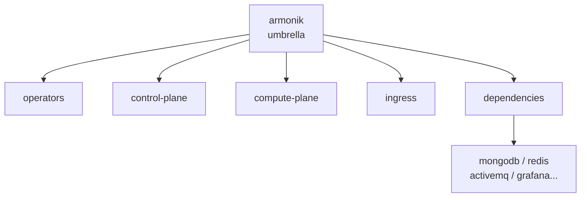
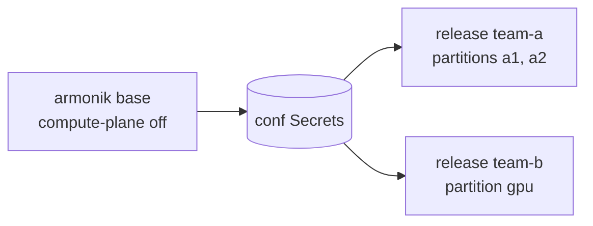
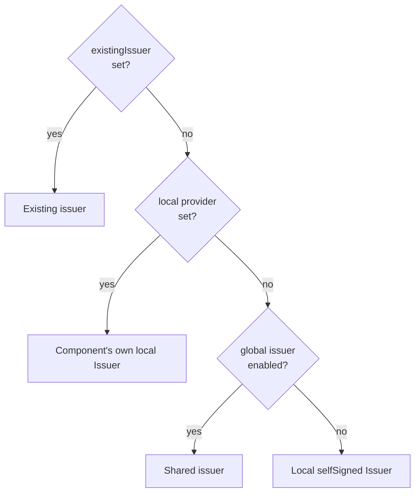

# ArmoniK Helm Charts — User Guide

A practical guide to deploying ArmoniK with the ArmoniK Helm charts.

## Table of contents

1. [Overview](#1-overview)
2. [Getting the charts](#2-getting-the-charts)
3. [Two-step deployment (recommended)](#3-two-step-deployment-recommended)
4. [Modularity: enable / disable](#4-modularity-enable--disable)
5. [Compute planes as independent releases](#5-compute-planes-as-independent-releases)
6. [TLS: enable, disable, custom issuer](#6-tls-enable-disable-custom-issuer)
7. [Cheat sheet](#7-cheat-sheet)

---

## 1. Overview

ArmoniK is deployed with an **umbrella chart** (`armonik`) made of subcharts you enable or disable through values. Each subchart can also be installed **on its own**, in its own release.



| Chart | Role | Toggle in the umbrella |
| --- | --- | --- |
| `armonik-operators` | KEDA, cert-manager, External Secrets, Percona operator, Prometheus stack | `global.armonik.operators.<op>.deploy` |
| `armonik-control-plane` | Submitter, metrics-exporter, init job | `control-plane.enabled` |
| `armonik-compute-plane` | Partitions (polling-agent + worker), one Deployment each | `compute-plane.enabled` |
| `armonik-ingress` | Nginx (gRPC/HTTP), admin GUI, TLS/mTLS | `ingress.enabled` |
| `armonik-dependencies` | MongoDB, Redis, ActiveMQ, RabbitMQ, Grafana, Fluent Bit, Seq | `dependencies.<name>.enabled` |
| `armonik-common` | Library chart: shared helpers and `global.armonik` defaults | none (not deployable) |

> **Rule of thumb:** `enabled: true/false` for a component, `deploy` / `available` for an operator.

---

## 2. Getting the charts

The charts are published as **OCI artifacts on Docker Hub**, one repository per chart:

| Chart | OCI reference |
| --- | --- |
| Umbrella | `oci://registry-1.docker.io/dockerhubaneo/armonik` |
| Operators | `oci://registry-1.docker.io/dockerhubaneo/armonik-operators` |
| Control plane | `oci://registry-1.docker.io/dockerhubaneo/armonik-control-plane` |
| Compute plane | `oci://registry-1.docker.io/dockerhubaneo/armonik-compute-plane` |
| Ingress | `oci://registry-1.docker.io/dockerhubaneo/armonik-ingress` |
| Dependencies | `oci://registry-1.docker.io/dockerhubaneo/armonik-dependencies` |
| ActiveMQ | `oci://registry-1.docker.io/dockerhubaneo/activemq` |

### From Docker Hub (recommended)

```bash
# Common variables used in every example of this guide
REPO=oci://registry-1.docker.io/dockerhubaneo
VERSION=X.Y.Z   # always pin a released version

# Inspect the default values of a chart
helm show values $REPO/armonik --version $VERSION > armonik-values.yaml

# Install directly from the registry
helm install armonik $REPO/armonik --version $VERSION \
  -n armonik --create-namespace
```

### From the git repository

```bash
# Vendor the chart dependencies first, then install by path
./charts/update-charts.sh
helm install armonik ./charts/armonik -n armonik --create-namespace
```

Every example below uses `$REPO/<chart> --version $VERSION`; replace it with `./charts/<chart>` to use a local checkout. For air-gapped clusters, see [`airgap.md`](airgap.md).

---

## 3. Two-step deployment (recommended)

Install the operators **once per cluster**, then one or more ArmoniK releases that **consume** them. The all-in-one umbrella also works, but the two-step layout makes upgrades and uninstalls much simpler.

### Operator flags

| Flag | Meaning |
| --- | --- |
| `deploy` | This release installs the operator and its CRDs |
| `available` | The CRDs exist (installed here or elsewhere): custom resources can be rendered |
| `namespace` | Where the operator runs (required when it is external) |

### Step 1 — Operators

```bash
# Install cluster-wide operators once (KEDA, cert-manager, ESO, Percona, Prometheus)
helm install armonik-operators $REPO/armonik-operators --version $VERSION \
  -n operators --create-namespace
```

### Step 2 — ArmoniK, consuming the operators

`values-layered.yaml`:

```yaml
# Operators come from the "armonik-operators" release: do not install them here
global:
  armonik:
    operators:
      externalSecrets:
        deploy: false
        available: true      # CRDs exist -> render ExternalSecret/SecretStore
        namespace: operators
      keda:
        deploy: false
        available: true      # render ScaledObjects
        namespace: operators
      certManager:
        deploy: false
        available: true      # render Certificates/Issuers
        namespace: operators
      mongodbOperator:
        deploy: false
        available: true
        namespace: operators
      prometheusOperator:
        deploy: false
        available: true
        namespace: operators # required: the Prometheus URL is derived from it
```

```bash
# Install ArmoniK without its own operators
helm install armonik $REPO/armonik --version $VERSION \
  -n armonik --create-namespace \
  -f values-layered.yaml
```

### Check

The release `NOTES.txt` prints the status of each operator:

```text
Operators:
  - keda: external (already present in the cluster)
  - certManager: external (already present in the cluster)
```

### Uninstall (reverse order)

```bash
# 1. Application first: a plain uninstall is enough in layered mode
helm uninstall armonik -n armonik
# 2. Operators last: their CRDs are cluster-scoped
helm uninstall armonik-operators -n operators
```
---

## 4. Modularity: enable / disable

Every component is driven by a boolean.

### Example 1 — Disable dependencies

```yaml
# Keep MongoDB and Redis, drop observability and ActiveMQ
dependencies:
  activemq:
    enabled: false
  rabbitmq:
    enabled: true        # switch queue backend to RabbitMQ
  grafana:
    enabled: false
  fluent-bit:
    enabled: false
  seq:
    enabled: false
```

### Example 2 — Bring your own MongoDB

```yaml
# Use an external MongoDB instead of the in-cluster Percona one
dependencies:
  mongodb:
    enabled: false
  mongodb-exporter:
    enabled: false
# Then pass the connection via conf.core.env / conf.core.envFromSecret
```

### Example 3 — A "base" release without workers

```yaml
# Control plane + storage + conf only; partitions come from other releases (section 5)
compute-plane:
  enabled: false
```

### Example 4 — No ingress

```yaml
# No nginx / admin GUI: the control plane is reachable in-cluster only
ingress:
  enabled: false
```

### Example 5 — Remove a default partition

Partitions accumulate across values files; remove one with `null`:

```bash
# Remove the htcmock demo partition shipped in the default values
helm upgrade armonik $REPO/armonik --version $VERSION -n armonik \
  --reuse-values --set compute-plane.partitions.htcmock=null
```
### Example 6 — Customize without forking the chart

| Need | Mechanism |
| --- | --- |
| Append to a list (env, volumes, sidecar) | `extraEnv`, `extraVolumes`, `extraContainers`, … |
| Override a scalar or a map | `containerPatch`, `podSpecPatch` |
| Anything else | `helm --post-renderer` |

```yaml
# Add a sidecar and override the grace period on every partition
compute-plane:
  partitionCommon:
    extraContainers:
      - name: debug
        image: busybox:1.37.0
        command: ["sh", "-c", "sleep infinity"]
    podSpecPatch:
      terminationGracePeriodSeconds: 120   # scalar: the patch wins
```

---

## 5. Compute planes as independent releases

Each team or application can own **its own release of partitions**, installed, upgraded and removed without touching anything else. The link to the base release is `conf.source` (name of the umbrella release that owns the configuration Secrets).



### Step 1 — Base release

```bash
# Control plane + storage + conf, no workers
helm install armonik $REPO/armonik --version $VERSION -n armonik \
  -f values-layered.yaml \
  --set compute-plane.enabled=false
```

### Step 2 — One release per group of partitions

`team-a.yaml`:

```yaml
# compute-plane.enabled=false in Step 1 means no ServiceAccount either, so create one here
serviceAccount:
  create: true
  name: compute-plane

# One Deployment (+ one KEDA ScaledObject) per partition
partitions:
  team-a-cpu:
    worker:
      image:
        repository: my-registry/my-team-a-worker   # full path, no separate "name" field
        tag: "1.4.0"
    hpa:
      maxReplicaCount: 50     # per-partition autoscaling bound
  team-a-light:
    worker:
      image:
        repository: my-registry/my-team-a-worker
        tag: "1.4.0"
```

```bash
# Same namespace as the base release so the conf Secrets are reachable
helm install team-a $REPO/armonik-compute-plane --version $VERSION -n armonik \
  --set conf.source=armonik \
  -f team-a.yaml
```

### Step 3 — operations

```bash
# Upgrade team-a's worker only: the base release and team-b are untouched
helm upgrade team-a $REPO/armonik-compute-plane --version $VERSION -n armonik \
  --reuse-values --set partitions.team-a-cpu.worker.image.tag=1.5.0

# Remove team-a entirely
helm uninstall team-a -n armonik
```

### Values shared by all partitions of a release

```yaml
# partitionCommon is merged under every partition; per-partition values win
partitionCommon:
  nodeSelector:
    workload: armonik
  worker:
    resources:
      limits:
        cpu: "2000m"
        memory: "4Gi"
partitions:
  gpu:
    nodeSelector:
      workload: gpu          # overrides partitionCommon for this partition
    worker:
      image:
        repository: my-registry/my-gpu-worker
```

### Rules

| Rule | Why |
| --- | --- |
| Same namespace as the base release | The conf Secrets live there |
| `conf.source=<base release>` | Points to the right Secrets |
| Same `conf.mountPath` if changed in the base | Mount path of the configuration |
| No KEDA → `global.armonik.operators.keda.available=false` | Partitions deploy without autoscaling |
| NetworkPolicy in another namespace | Add `networkPolicy.extraEgressRules` (see [`network-policies.md`](network-policies.md)) |

The same pattern applies to the control plane:

```bash
# Standalone control plane pointing at the base release's conf Secrets
helm install my-cp $REPO/armonik-control-plane --version $VERSION -n armonik \
  --set conf.source=armonik
```

**Leave `control-plane.enabled: true` on the base release.** `my-cp` is a second, independent
control plane, reachable only by clients that call it directly - the base's ingress keeps using
its own. Setting the base's `control-plane.enabled=false` does not redirect the ingress to `my-cp`;
it only breaks the base's control-plane URL. 
To route the ingress to `my-cp` instead, set `ingress.control_plane_url` to `my-cp`'s Service URL.

---

## 6. TLS: enable, disable, custom issuer

TLS is **disabled by default**, except MongoDB (`tls.mode: preferTLS`). All four - ingress, Redis, ActiveMQ, MongoDB - can get their certificates from cert-manager.

### Which issuer is used? (priority order)



The choice is made per component, so modes can be mixed within one release.

### Example 1 — Enable TLS on the ingress (zero config)

```yaml
# Self-signed certificate generated by cert-manager for nginx
ingress:
  tls:
    enabled: true
    certManager:
      extraDnsNames:
        - armonik.example.com   # hostname clients use from outside the cluster
```

### Example 2 — Add mTLS

```yaml
# Clients must present a cert signed by this CA with an allowed CN
ingress:
  tls:
    enabled: true
  mtls:
    enabled: true
    certificationAuthority:
      existingSecret: client-ca   # or pem: | ... ; empty = issued by cert-manager
    trustedCommonNames:
      - client.armonik.local
```

### Example 3 — Disable TLS

```yaml
# Plain HTTP/gRPC (default) - development only
ingress:
  tls:
    enabled: false
  mtls:
    enabled: false
```

### Example 4 — Use an existing (custom) issuer

```yaml
# Point the ingress at an Issuer/ClusterIssuer already present in the cluster
ingress:
  tls:
    enabled: true
    certManager:
      existingIssuer:
        enabled: true
        kind: ClusterIssuer
        name: my-company-ca
        group: cert-manager.io
```

Nothing is created: if the issuer does not exist, the `Certificate` stays `READY: False` with no error.

### Example 5 — One shared issuer for the whole release

```yaml
# One shared Issuer, created by this release, used by every TLS consumer
global:
  armonik:
    certManager:
      issuer:
        enabled: true
certManagerIssuer:
  create: true
  provider: ca            # selfSigned | ca | vault | acme | venafi | googleCas
  ca:
    secretName: my-ca-key-pair

ingress:
  tls:
    enabled: true         # no provider set -> uses the shared issuer
dependencies:
  redis:
    tls:
      enabled: true
      existingSecret: redis-tls
      certManager:
        enabled: true     # no provider set -> uses the shared issuer
```

### Pitfalls

- **MongoDB rejects `selfSigned`**: replica set members must share a CA. Use `ca`, `vault`, `acme`, `venafi` or `googleCas`.
- **Google CAS**: set `global.armonik.operators.googleCasIssuer.deploy=true` and extend cert-manager's `approveSignerNames` (the list replaces the default one).
- To keep a local `selfSigned` issuer while the global issuer is enabled, write `provider: selfSigned` explicitly.

Full details: [`cert-manager-issuer.md`](cert-manager-issuer.md).

---

## 7. Cheat sheet

| I want to… | Values / command |
| --- | --- |
| Show a chart's values | `helm show values $REPO/<chart> --version $VERSION` |
| Mirror images to a private registry | `global.imageRegistry=my-registry.example.com/mirror` |
| Install the operators once | `helm install armonik-operators $REPO/armonik-operators --version $VERSION -n operators` |
| Consume external operators | `global.armonik.operators.<op>.deploy=false` + `namespace=operators` |
| Disable a component | `<component>.enabled=false` (e.g. `ingress.enabled=false`) |
| Disable a dependency | `dependencies.<name>.enabled=false` |
| Release without workers | `compute-plane.enabled=false` |
| Add partitions separately | `helm install <rel> $REPO/armonik-compute-plane --version $VERSION --set conf.source=armonik` |
| Remove a partition | `--set compute-plane.partitions.<name>=null` |

## See also

- [`cert-manager-issuer.md`](cert-manager-issuer.md) — issuer resolution and providers in depth
- [`uninstall.md`](uninstall.md) — teardown procedure per deployment mode
- [`network-policies.md`](network-policies.md) — NetworkPolicy for standalone releases
- [`airgap.md`](airgap.md) — packaging and offline installation